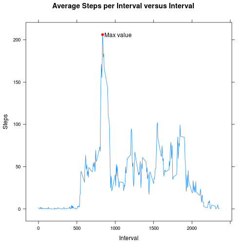
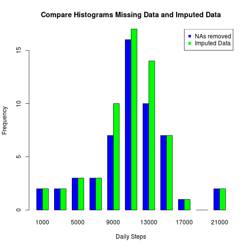

# Reproducible Research: Peer Assessment 1

## The Data Set

The data set comes with the git repo at http://github.com/rdpeng/RepData_PeerAssessment1 when it is forked and cloned. It is contained in the file activity.zip.

The variables included in this dataset are:
- steps: Number of steps taking in a 5-minute interval (missing values are coded as NA)
- date: The date on which the measurement was taken in YYYY-MM-DD format
- interval: Identifier for the 5-minute interval in which measurement was taken

## Loading and preprocessing the data

Assignment statement:
>Show any code that is needed to  
>1. Load the data (i.e. read.csv())  
>2. Process/transform the data (if necessary) into a format suitable for your analysis

Transformations performed here are:  
1. Remove intervals that have no data and save in data frame named cleanDat  
2. Bin the steps data into daily totals and save in a data frame named dailySteps


```r
# Data has already been downloaded and unzipped in the working directory, now read it
dat <- read.csv("activity.csv")

# Remove the intervals that contain NAs and save in data frame named cleanDat
cleanDat <- dat[complete.cases(dat),]

# Use plyr to sum the total steps for each day and save in data frame named dailySteps
library(plyr)
dailySteps <- ddply(cleanDat[-3], .(date), numcolwise(sum))
```

## What is mean total number of steps taken per day?

Assignment statement:
>For this part of the assignment, you can ignore the missing values in the dataset.  
>1. Make a histogram of the total number of steps taken each day  
>2. Calculate and report the mean and median total number of steps taken per day

### Histogram of the number of steps taken per day.

The default of five bins is a bit coarse so the histogram is set to 10 bins.


```r
# Plot histogram with 10 bins
hist(dailySteps$steps, col="steelblue", breaks=10, xlab="Daily Steps", ylab="Number of Days", main="Histogram of Number of Steps per Day")
```

 

### Mean and median total number of steps taken per day

Mean and median are computed on the data set after missing data have been removed.


```r
mean(dailySteps$steps)
```

```
## [1] 10766
```

```r
median(dailySteps$steps)
```

```
## [1] 10765
```

## What is the average daily activity pattern?

Assignment statement:  
>1. Make a time series plot (i.e. type = "l") of the 5-minute interval (x-axis) and the average number of steps taken, averaged across all days (y-axis)  
>2. Which 5-minute interval, on average across all the days in the dataset, contains the maximum number of steps?

### Time series plot of interval steps versus avg steps taken, averaged across all days

Compute the average steps taken in each interval across all days.


```r
intervalAverages <- ddply(cleanDat[-2], .(interval), numcolwise(mean))
```

Plot the time series of interval averages averaged across all days.


```r
# I need the maximum value and interval to do some nice stuff with the plot
maxValue <- max(intervalAverages$steps)
maxInterval <- intervalAverages[which.max(intervalAverages$steps), "interval"]

# Use the lattice package for this plot
library(lattice)
xyplot(intervalAverages$steps ~ intervalAverages$interval,
       main="Average Steps per Interval versus Interval",
       xlab="Interval", ylab="Steps",
       panel = function(x, y, ...) {
           panel.xyplot(x, y, data=intervalAverages, type="l", main="Average Steps Per Interval versus Interval")
           panel.points(intervalAverages[which.max(intervalAverages$steps), "interval"], max(intervalAverages$steps), pch=19, col="red")
           panel.text(maxInterval + 200, maxValue, labels="Max value")
    })
```

 

The interval with the maximum number of steps, on average across all days, is:


```r
# Interval with max number of steps, on average across all days
intervalAverages[which.max(intervalAverages$steps), "interval"]
```

```
## [1] 835
```

## Imputing missing values

Assignment statement:
>Note that there are a number of days/intervals where there are missing values (coded as NA). The presence of missing days may introduce bias into some calculations or summaries of the data.

>Calculate and report the total number of missing values in the dataset (i.e. the total number of rows with NAs)

>Devise a strategy for filling in all of the missing values in the dataset. The strategy does not need to be sophisticated. For example, you could use the mean/median for that day, or the mean for that 5-minute interval, etc.

>Create a new dataset that is equal to the original dataset but with the missing data filled in.

>Make a histogram of the total number of steps taken each day and Calculate and report the mean and median total number of steps taken per day. Do these values differ from the estimates from the first part of the assignment? What is the impact of imputing missing data on the estimates of the total daily number of steps?

### Total number of missing values (number of rows with NAs)

Previously created a data frame named cleanDat with rows containing NAs removed. So the number of rows with NAs is the difference between the number of rows in the original data frame and the number of rows in cleanDat, ala

```r
nrow(dat) - nrow(cleanDat)
```

```
## [1] 2304
```

Another way, just to explore and confirm, is using which(), ala

```r
length(which(is.na(dat$steps)))
```

```
## [1] 2304
```
Which yields the same answer so must be correct!

### Strategy for filling in missing values

The strategy I chose is to replace the missing values on a per-day basis with the average value for that weekday. For example, the first day of the data set is Monday and it has missing values. So I compute the average number of steps for all the other Mondays and use that to replace the missing Monday data in the original data set.


```r
# Add a variable called day to the dailySteps data frame. Uses lubridate package.
library(lubridate)
```

```
## 
## Attaching package: 'lubridate'
## 
## The following object is masked from 'package:plyr':
## 
##     here
```

```r
dailySteps$day <- wday(dailySteps$date, label=TRUE)

# Get the days that have zero steps
zeroDays <- which(dailySteps$steps == 0)

# Subset to get only days with nonzero steps with which to compute averages
nonzeroDays <- dailySteps[dailySteps$steps !=0,]

# Compute the average steps for each weekday using days with nonzero data.
dayAverages <- ddply(nonzeroDays[-1], .(day), numcolwise(mean))
```

### Create new data set with imputed values for missing data


```r
# Create a new daily steps data frame without the NAs removed
newDailySteps <- ddply(dat[-3], .(date), numcolwise(sum))

# Add a day variable to the data frame
newDailySteps$day <- wday(newDailySteps$date, label=TRUE)

# Substitute in the weekday average for days with NAs
for (i in 1:nrow(newDailySteps))
    if (is.na(newDailySteps[i, "steps"]))
        newDailySteps[i, "steps"] <- dayAverages[dayAverages$day==newDailySteps[i, "day"], "steps"]
```

### Histogram, mean and median of data with imputed missing values

Now, working with the data frame named newDailySteps that has had missing values replaced with imputed values, the histogram looks like this.


```r
# Plot histogram with 10 bins
hist(newDailySteps$steps, col="steelblue", breaks=10, xlab="Daily Steps", ylab="Number of Days", main="Histogram of Daily Steps with Imputed Data")

# Add mean and median lines - not required for assignment but makes it more useful
abline(v=mean(newDailySteps$steps), col="magenta", lwd=4)
abline(v=median(newDailySteps$steps), col="orange", lwd=4)
legend("topright", lty=1, lwd=4, col=c("magenta","orange"), legend=c("Mean","Median"))
```

 

The  new histogram looks very similar to the original one, although it looks like the center bins are a little taller. Let's take a look at those bins side-by-side using the plotrix package.


```r
library(plotrix)
l <- list(dailySteps$steps, newDailySteps$steps)
multhist(l, xlab="Daily Steps", ylab="Frequency", col=c("blue", "green"), main="Compare Histograms Missing Data and Imputed Data")
legendText <- c("NAs removed", "Imputed Data")
legend("topright", legend=legendText, col=c("blue", "green"), pch=15)
```

 

Indeed, the three center bins have a significantly higher fequency of occurrence when using imputed data for the missing data.

The new mean and median are:


```r
mean(newDailySteps$steps)
```

```
## [1] 10821
```

```r
median(newDailySteps$steps)
```

```
## [1] 11015
```

In answer to the first question for this part of the assignment,
>Do these values differ from the estimates from the first part of the assignment?  

The answer is YES, they differ significantly.

In answer to the second question for this part of the assignment,
>What is the impact of imputing missing data on the estimates of the total daily number of steps?  

The impact is to raise the estimates significantly. This was the case because a large number of the imputed values fell into the bins for higher numbers of steps, causing the mean and median to increase.

## Are there differences in activity patterns between weekdays and weekends?

Assignment statement:  
>For this part the weekdays() function may be of some help here. Use the dataset with the filled-in missing values for this part.  
>1. Create a new factor variable in the dataset with two levels – “weekday” and “weekend” indicating whether a given date is a weekday or weekend day.  
>2. Make a panel plot containing a time series plot (i.e. type = "l") of the 5-minute interval (x-axis) and the average number of steps taken, averaged across all weekday days or weekend days (y-axis). The plot should look something like the following, which was creating using simulated data: (example charts)

### Create the new factor variable and add it to the data set

The unfortunate choice I made in the step above for the imputed data exercise means my new data set does not have intervals - they are all combined into steps per day. That means I have to redo the imputed data steps but for intervals to create the data set needed for this part of the assignment. (I should have read ahead and realized the implications. Or the assignment instructions could have been friendlier by pointing out we will need a filled in data set with intervals to complete the last question.)

So impute values to replace missing interval data and create a new data set for use in this section.


```r
# Subset data to get only intervals with nonzero steps with which to compute averages
nonnaIntervals <- dat[!is.na(dat$steps),]

# Compute the average steps for each weekday using days with nonzero data.
intervalAverages <- ddply(nonnaIntervals, .(interval), numcolwise(mean))

# Make a copy of the data set to work on
newIntervalSteps <- dat

# Substitute in the interval average for intervals with NAs
for (i in 1:nrow(newIntervalSteps))
    if (is.na(newIntervalSteps[i, "steps"]))
        newIntervalSteps[i, "steps"] <- intervalAverages[intervalAverages$interval==newIntervalSteps[i, "interval"], "steps"]
```

Add a variable named "day"" to the new interval data set.


```r
# Add a day variable to the data frame
newIntervalSteps$day <- wday(newIntervalSteps$date, label=TRUE)
```

Now I have a data set with imputed values for the missing interval data and can use it to generate the plots for this section.


```r
# Create weekend set
enddays <- c("Sat", "Sun")

# Go through all rows of data set and add the new variable
for (i in 1:nrow(newIntervalSteps)) {
    if (newIntervalSteps[i, "day"] %in% enddays)
        newIntervalSteps[i, "weekDayEnd"] <- "weekend"
    else newIntervalSteps[i, "weekDayEnd"] <- "weekday"
}
```

Average the interval values across the weekdays or weekend days.


```r
newIntervalAverages <- ddply(newIntervalSteps, .(weekDayEnd, interval), numcolwise(mean))
```


### Make the two-panel plot

Now plot the two panel plot.


```r
xyplot(steps ~ interval | weekDayEnd, data = newIntervalAverages, layout=c(1,2), type="l", xlab="Interval", ylab="Number of steps")
```

 

In answer to the question:  
>Are there differences in activity patterns between weekdays and weekends?  

Yes, there are some differences. The maximum number of steps in an interval is 230 and occurs in interval 835 on a weekday. It is a sharp peak at the maximum with a sustained large number until interval 930. In contrast, the maximum number of steps on a weekend is 167 at interval 915 and there are two peaks on weekends with another one of 142 at interval 1215. The plots also show that there are generally more steps taken during the middle of the day on weekends than weekdays. 

One possible conclusion one might draw is that the ramp up to a high peak and sustained higher number of steps on weekday mornings reflects getting ready and heading to work/school. Once there they tend to sit for long periods of time. In contrast, on weekends people sleep in a little longer, maybe even until noon, and then are more active the rest of the day.
